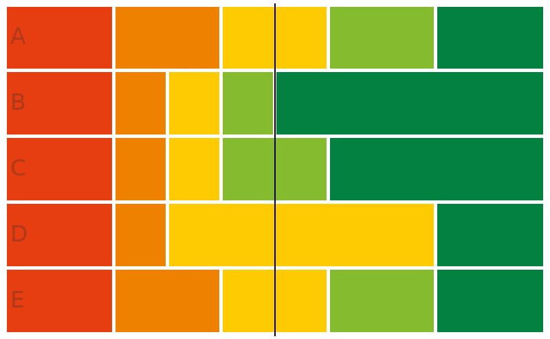

# Majority Judgment for Golang

[](LICENSE.md)
[](https://github.com/MieuxVoter/majority-judgment-library-go/actions/workflows/go.yml)
[](https://github.com/MieuxVoter/majority-judgment-library-go/releases)
[](https://app.codecov.io/gh/MieuxVoter/majority-judgment-library-go/)

[](https://discord.gg/rAAQG9S)

> WORK IN PROGRESS
> - [x] Basic Working Implementation
> - [ ] Balancers (static and median) 
> - [ ] Decide on integer types 
> - [ ] Clean up and Release

A Go library to deliberate using Majority Judgment.

We use a **score-based algorithm**, for performance and scalability.

Supports billions of judgments and thousands of proposals per poll, if need be.


## Installation

    go get -u github.com/mieuxvoter/judgment


## Usage

Say you have the following tally:



You can compute out the majority judgment rank of each proposal like so:

```go

package main

import (
	"fmt"
	"log"

	"github.com/mieuxvoter/judgment"
)

func main() {

    poll := &(judgment.PollTally{
        AmountOfJudges: 10,
        Proposals: []*judgment.ProposalTally{
            {Tally: []uint64{2, 2, 2, 2, 2}}, // Proposal A   Amount of judgments received for each grade,
            {Tally: []uint64{2, 1, 1, 1, 5}}, // Proposal B   from "worst" grade to "best" grade.
            {Tally: []uint64{2, 1, 1, 2, 4}}, // Proposal C   Make sure all tallies are balanced, that is they
            {Tally: []uint64{2, 1, 5, 0, 2}}, // Proposal D   hold the same total amount of judgments.
            {Tally: []uint64{2, 2, 2, 2, 2}}, // Proposal E   Equal proposals share the same rank.
            // …
        },
    })
    deliberator := &(judgment.MajorityJudgment{})
    result, err := deliberator.Deliberate(poll)

    if nil != err {
        log.Fatalf("Deliberation failed: %v", err)
    }
    
    // Proposals results are ordered like tallies, but Rank is available. 
    // result.Proposals[0].Rank == 4
    // result.Proposals[1].Rank == 1
    // result.Proposals[2].Rank == 2
    // result.Proposals[4].Rank == 3
    // result.Proposals[5].Rank == 4

}
```


## License

`MIT` 🐜


## Contribute

A review by a seasoned `Go` veteran would be appreciated.


