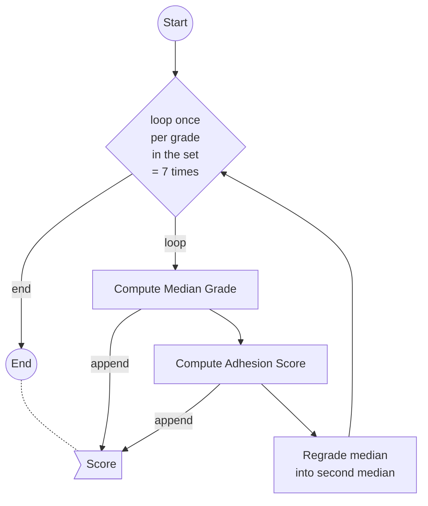
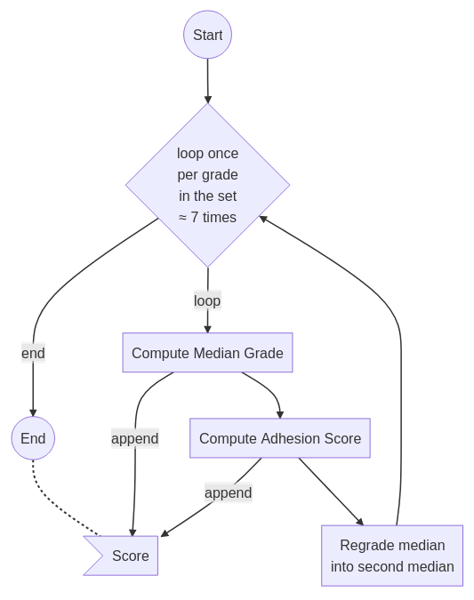

# Majority Judgment Score

On this page you will find explanations about **how one can compute a score for each proposal** (aka. candidate), in order to **rank** them efficiently.

[TOC]

## About the Score

A Proposal's Score is a long string of characters, mostly numbers with (optional) separation characters for readability.  We use a `string` instead of an `integer` because leading zeroes are meaningful.

**A higher _score_ (lexicographically) means a better _rank_.**
Equal _scores_ (in extreme cases) mean equal _ranks_.

## Why a Score?

Majority Judgment is easily resolved geometrically ("by eye") when looking at the merit profiles.  The algorithm our brains follow is simple (we compare colors and sticks' lengths).

The score is an intermediate representation of each proposal's colors and "sticks lengths" that we can compare lexicographically to another proposal's so we don't have to re-analyze proposals when comparing them between themselves to see which has the better rank.

It's **computationally efficient**, and scales very well[^constant_scale] to billions of judges.

[^constant_scale]: I'd say it's a constant scale, but this still needs to be demonstrated properly

Furthermore, score calculus can be parallelized per proposal, enabling efficient scaling to thousands of proposals in one poll.

## Concepts

### Judges, Judgments & Grades

Each Judge may deliver **one** Judgment of a certain Grade to **each** Proposal.  The set of available Grades is defined by the poll's organizer.

Elector → Judge | Participant[^judge_vs_participant]
Vote → Judgment
Candidate → Proposal

[^judge_vs_participant]: Join the [debate about majority judgment semantics](https://forum.mieuxvoter.fr/t/terminologie-mieuxvoter/42)

### Median Grade

The median grade of a proposal is the grade of the judgment in the middle when you align all the judgments received by the proposal, sorted by (increasing) grade.

> FIXME: insert drawing/picture here (help wanted)

When there is an even number of judgments, use the lower median (_favor contestation_, best make this a parameter of your algorithm).

There will be at least 50% of judges thinking the proposal is at least as good as the median grade.

### Second Median Grade

The second median grade is the grade adjacent to the median grade, on the side of the biggest group outside of the median grade.

> FIXME: insert picture/drawing here (help wanted)

It is either the lowest grade of the adhesion group, or the highest grade of the contestation group.

If both groups are of the same size, best use the contestation group. (and make it a parameter of your algorithm)

If both groups are empty, the second median grade should be the "worst" grade.

### Adhesion Score

The adhesion score describes how well the proposal is graded outside of the median grade.

When two proposals share the same median grade, they may usually be ranked by their adhesion score (except in renewed equality, where we need to look deeper).

See below for the construction of the adhesion score.

## Anatomy of a Score

`<medianScore>/<secondMedianScore>/ … /<nthMedianScore>`

Each _median score_ is built by the concatenation of the _median grade_ and the _adhesion score_:

`<medianScore> = <medianGrade>_<adhesionScore>`

The _adhesion score_ is built by offsetting the _second median group size_:

`<adhesionScore> = <totalAmountOfJudges> ± <secondMedianGroupSize>`

The _second median group_ is the biggest group of the two groups of judges out of the median.

In case of equal-sized groups, we usually prefer the contestation group (all the judges that gave judgments of lower grades than median), but this preference can (and should) be a parameter of your algorithm.

The sign of the operation `±` is determined by whether the second group is an adhesion group (`+`) or a contestation group (`-`).

The purpose of adding `totalAmountOfJudges` is to keep a lexicographical order without dealing with negative numbers and their `-` prefix.

Usage of the seperator characters `/` and `_` in the score is useful for human inspection of the score, but not mandatory.

The second median score (and others, up to the amount of available grades) are built the same, after moving the median grade judgments into the second median grade.

## Leading Zeroes

**Leading zeroes matter.**  When you format Grades or Scores to `string`, make sure to always cast to the same amount of digits (largest one needed).

Best use an equivalent of `sprintf("%0"+amountOfDigitsForGrade+"d", medianGrade)`.

## Regrade & Loop

In case both the median grade and the adhesion score are identical, we need to look deeper.

To that effect, we regrade the judgments of the median grade into the second median grade and we repeat the procedure with the modified tally.

## By Example

Let's pretend we have the following tally with `10` judges:

|            | To Reject | Passable | Good | Excellent |
|------------|-----------|----------|------|-----------|
|   Pizza    |     3     |     2    |   2  |     3     |
|   Chips    |     2     |     4    |   2  |     2     |
|   Pasta    |     3     |     2    |   3  |     2     |
|   Bread    |     1     |     3    |   4  |     2     |

We initialize the score with the median grade (in numeric form[^letters_would_work]):

[^letters_would_work]: It would also work with letters, or any adequately ordered characters.

Pizza: `1` (passable)
Chips: `1` (passable)
Pasta: `1` (passable)
Bread: `2` (good)

We can already see that Bread is going to be the winner of the poll, in 1st rank

Onto the next step: the adhesion score.

Pizza: `1_15` (10 + 5)
Chips: `1_14` (10 + 4)
Pasta: `1_15` (10 + 5)
Bread: `2_06` (10 - 4)

We can now see that Chips will come last, in 4th rank.

Let's regrade the median into the second median to get the following tally:

|            | To Reject | Passable | Good | Excellent |
|------------|-----------|----------|------|-----------|
|   Pizza    |     3     |     0    |   4  |     3     |
|   Chips    |     2     |     0    |   6  |     2     |
|   Pasta    |     3     |     0    |   5  |     2     |
|   Bread    |     1     |     7    |   0  |     2     |

Now we can restart the loop, and append the new median grade:

Pizza: `1_15/2` (good)
Chips: `1_14/2` (good)
Pasta: `1_15/2` (good)
Bread: `2_06/1` (passable)

Let's add the new adhesion score:

Pizza: `1_15/2_07` (10 - 3)
Chips: `1_14/2_08` (10 - 2)
Pasta: `1_15/2_07` (10 - 3)
Bread: `2_06/1_12` (10 + 2)

It's still not enough yet to decide between Pizza and Pasta.
Let's loop again !

|            | To Reject | Passable | Good | Excellent |
|------------|-----------|----------|------|-----------|
|   Pizza    |     7     |     0    |   0  |     3     |
|   Chips    |     8     |     0    |   0  |     2     |
|   Pasta    |     8     |     0    |   0  |     2     |
|   Bread    |     1     |     0    |   0  |     9     |

Pizza: `1_15/2_07/0` (to reject)
Chips: `1_14/2_08/0` (to reject)
Pasta: `1_15/2_07/0 `(to reject)
Bread: `2_06/1_12/3` (excellent)

Pizza: `1_15/2_07/0_13` (10 + 3)
Chips: `1_14/2_08/0_12` (10 + 2)
Pasta: `1_15/2_07/0_12` (10 + 2)
Bread: `2_06/1_12/3_09` (10 - 1)

Now Pasta and Pizza have different scores and we can observe that Pizza > Pasta.

The final rank, derived from the lexicographical inverse of the score, is therefore:

1. `Bread`  (`2_06/1_12/3_09…`)
2. `Pizza`  (`1_15/2_07/0_13…`)
3. `Pasta`  (`1_15/2_07/0_12…`)
4. `Chips`  (`1_14/2_08/0_12…`)

## Prerequisites & Default Judgment

To stay fair, majority judgment resolution requires the proposals' tallies to hold the same total amount of judgments each.

In the wild, proposals may not be expected to receive the same amount of judgments, so a _"default judgment"_ strategy has to be defined in advance by the poll's organizer[^judges_may_choose].

[^judges_may_choose]: Judges may also individually choose how their _default judgment_ should be computed.  Recommended settings may be provided by organizers.

The default judgment is usually either:
- the "worst" judgment  (best with low amounts of proposals, incites proposals to be clear)
- the median judgment[^caution_disclaimer]  (trust the song of the crowd)
- attained through normalization[^caution_disclaimer]  (trust reasonable participation distribution)

[^caution_disclaimer]: _Caution:_ This strategy is less resilient to collegial proposal submissions[^collegial_submissions], since it favors low-participation proposals.

[^collegial_submissions]: Letting participants handle themselves the proposal submissions is a valuable feature.  Thankfully, participation issues can be mitigated in various ways, for example by stating in advance that proposals need at least a percentage (32% ?) of the median participation to enter the ranking pool.  The value of this inclusivity threshold could also be subjected to scrutinization.

